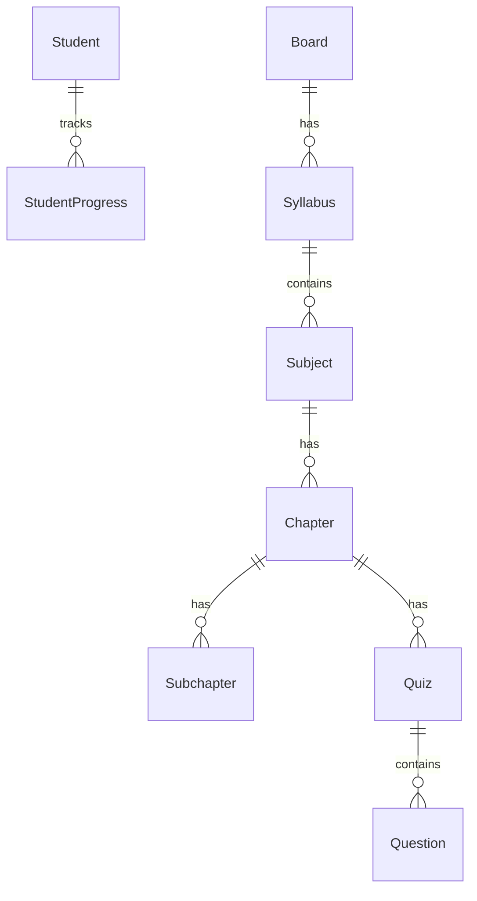

# AI Tutor - Database & Development Guide

## 📊 Database Overview

The app uses **SQLite** (`tutor.db`) with SQLAlchemy ORM. All models are in `backend/models/`.

---

## 🗂️ Key Database Tables



### Core Tables

| Table | Purpose | Key Fields |
|-------|---------|------------|
| `students` | User accounts | name, email, password_hash, grade_band, board |
| `boards` | Education boards | name (CBSE, ICSE, etc.) |
| `grades` | Grade levels | grade_name (1-2, 3-4, etc.), display_name |
| `languages` | Medium options | code, name, direction |
| `syllabi` | Links board+grade+subject | board_id, class_grade, subject |
| `subjects` | Math, Science, etc. | syllabus_id, name, code |
| `chapters` | Chapter content | subject_id, title, description, chapter_no |
| `subchapters` | Sub-topics | chapter_id, title, description |

---

## 🔧 How to Add New Data

### Option 1: Edit seed_db.py

```python
# backend/seed_db.py - Add new subjects
chapter_data = {
    "Math": [...],
    "Science": [...],
    "NEW_SUBJECT": [  # ← Add here
        {"title": "Chapter 1", "description": "Description"},
    ],
}
```

Then run:
```bash
cd backend
rm -f tutor.db                    # Delete old DB
source .venv/bin/activate
python seed_db.py                 # Re-seed
python api.py                     # Restart server
```

### Option 2: Add via API (Future Feature)

Create API endpoints in `backend/api.py` to add data dynamically.

---

## 📁 Project Structure

```
AI_Tutor/
├── backend/
│   ├── api.py              # FastAPI endpoints
│   ├── database.py         # DB connection
│   ├── seed_db.py          # Seed initial data
│   ├── models/             # SQLAlchemy models
│   │   ├── students.py
│   │   ├── board.py
│   │   ├── grade.py
│   │   ├── subject.py
│   │   ├── chapter.py
│   │   ├── subchapter.py
│   │   └── ...
│   └── tutor.db            # SQLite database (auto-created)
│
├── frontend/
│   ├── src/
│   │   ├── App.js          # Main app component
│   │   ├── themes.js       # Theme configurations
│   │   ├── ThemeContext.js # Theme state management
│   │   ├── styles.js       # Dynamic CSS generator
│   │   ├── api.js          # API calls
│   │   ├── meta.js         # Metadata API calls
│   │   └── views/          # Page components
│   │       ├── LoginView.js
│   │       ├── RegisterView.js
│   │       ├── DashboardView.js
│   │       └── ...
```

---

## 🚀 Common Development Tasks

### 1. Add a New Model

```python
# backend/models/new_model.py
from backend.database import Base
from sqlalchemy import Column, String, Integer
import uuid

class NewModel(Base):
    __tablename__ = "new_table"
    id = Column(String(36), primary_key=True, default=lambda: str(uuid.uuid4()))
    name = Column(String(100), nullable=False)
```

Register in `backend/models/__init__.py`:
```python
from backend.models.new_model import NewModel
```

### 2. Add API Endpoint

```python
# backend/api.py
@app.get("/new-endpoint")
def get_new_data():
    return {"message": "Hello!"}
```

### 3. Add Frontend API Call

```javascript
// frontend/src/api.js
export const fetchNewData = async () => {
  const response = await axios.get(`${API_URL}/new-endpoint`);
  return response.data;
};
```

### 4. Add New Theme Colors

```javascript
// frontend/src/themes.js
export const themes = {
  kids: { colors: { primary: '#FF6B9D', ... } },
  teen: { colors: { primary: '#667eea', ... } },
  mature: { colors: { primary: '#38B2AC', ... } },
  // Add new theme here
};
```

---

## 🔄 Quick Commands

```bash
# Start Backend
cd backend && source .venv/bin/activate && python api.py

# Start Frontend
cd frontend && npm start

# Reset Database
cd backend && rm -f tutor.db && python seed_db.py && python api.py

# Git Push
git add -A && git commit -m "message" && git push origin main
```

---

## 📝 Adding New Features Checklist

- [ ] Create model in `backend/models/`
- [ ] Register model in `__init__.py`
- [ ] Add seed data in `seed_db.py`
- [ ] Create API endpoint in `api.py`
- [ ] Add frontend API call in `api.js` or `meta.js`
- [ ] Create/update view component
- [ ] Test and commit!
