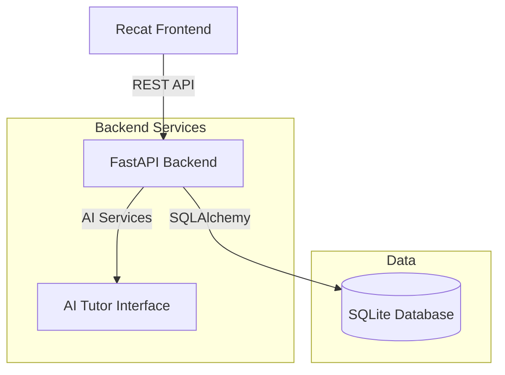

# 🚀 AI Tutor - Workflow & Architecture Guide

This document provides a complete guide on how to run the AI Tutor application, its architecture, and how to manage the database.

## 🏗️ System Architecture

The application follows a standard Client-Server architecture with a React frontend and a FastAPI (Python) backend using SQLite for persistence.



### Components
1.  **Frontend (`frontend/`)**: React application running on port `3000`. Handles user interface and interactions.
2.  **Backend (`backend/`)**: FastAPI application running on port `8000`. Provides endpoints for logic, data access, and AI integration.
3.  **Database (`tutor.db`)**: SQLite file storing Users, Subjects, Chapters, Flashcards, Scores, etc.

---

## 🛠️ Prerequisites

Ensure you have the following installed:
-   **Python 3.8+**
-   **Node.js 16+** & **npm**

---

## 🚀 How to Run Everything

### 1. Setup Backend
Open a terminal and navigate to the project root:

```bash
# Install dependencies
pip install -r backend/requirements.txt
```

### 2. Setup Frontend
Open a **new terminal tab/window**, navigate to `frontend`, and install dependencies:

```bash
cd frontend
npm install
```

### 3. Start the Application
You need to run both the backend and frontend simultaneously in separate terminals.

**Terminal 1: Backend**
```bash
# From project root
python backend/api.py
```
> Expected output: `🚀 Starting AI Tutor API...` (Running on http://127.0.0.1:8000)

**Terminal 2: Frontend**
```bash
# From project root
cd frontend
npm start
```
> Opens browser at http://localhost:3000

---

## 💾 Database Workflow

The database is managed via Python scripts in the root directory.

### 1. Resetting the Database
To completely wipe the database and recreate empty tables:

```bash
# From project root
python reset_db.py
```
> **Warning**: This deletes ALL data!

### 2. Seeding Initial Data
To populate the database with default boards, grades, subjects, and chapters:

```bash
# From project root
python seed_runner.py
```

### 3. Adding New Data (Custom)
To add *new* permanent data (like a new Subject or Chapter), you should modify the seed script so it persists across resets.

**File to duplicate/edit:** `backend/seed_db.py`

**Example: Adding a New Subject**
1.  Open `backend/seed_db.py`.
2.  Locate the section `# Seed Chapters for each subject`.
3.  Add your new content to the `chapter_data` dictionary:

```python
chapter_data = {
    # ... existing subjects ...
    "Computer Science": [
        {"title": "Intro to Python", "description": "Basics of coding"},
        {"title": "Web Development", "description": "HTML & CSS"},
    ]
}
```
4.  Run `python reset_db.py` followed by `python seed_runner.py` to apply changes.

---

## 🔄 Complete Development Cycle
1.  Stop running processes (Ctrl+C).
2.  Modify code or seed data (`backend/seed_db.py`).
3.  Reset & Seed DB: `python reset_db.py && python seed_runner.py`.
4.  Restart Backend: `python backend/api.py`.
5.  Restart Frontend: `npm start`.
